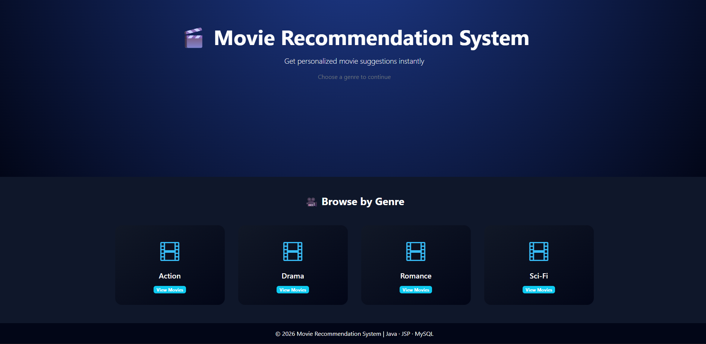
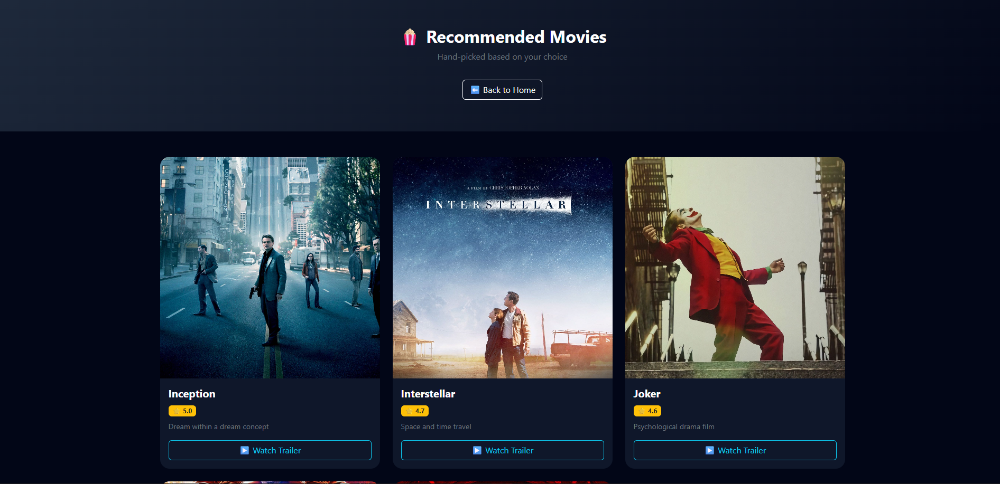
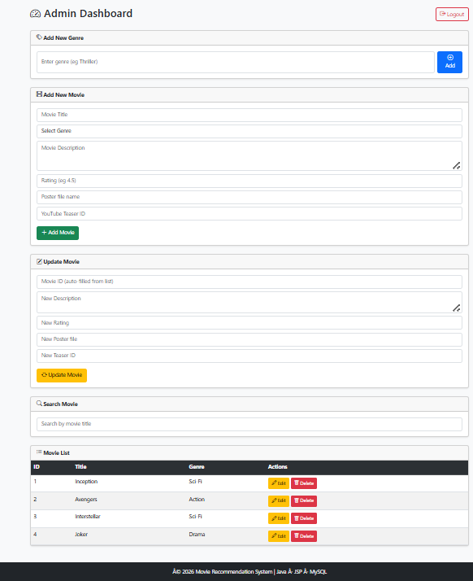

# 🎬 Movie Recommendation System (Java)

A full-stack **Movie Recommendation System** built using **Java, JSP, Servlets, MySQL, and Bootstrap**.  
The application recommends movies based on the user’s selected genre and provides an admin dashboard for managing movies.

---

## 🚀 Features

### 👤 User Side
- Browse movies by genre
- View top-rated movies
- Watch YouTube trailers in modal popup
- Clean, animated, responsive UI

### 🔐 Admin Side
- Secure admin login
- Add, update, delete movies
- Manage genres dynamically
- Upload movie posters & trailer IDs

---

## 🛠️ Tech Stack

| Layer        | Technology |
|-------------|------------|
| Frontend    | HTML, CSS, Bootstrap 5 |
| Backend     | Java, JSP, Servlets |
| Database    | MySQL |
| Server      | Apache Tomcat 9 |
| Tools       | Eclipse IDE, MySQL Workbench |

---

## 🗂️ Project Architecture

Client (Browser)
   ↓
JSP Pages (UI)
   ↓
Servlets (Controller)
   ↓
MySQL Database

---

## ⚙️ How to Run Locally

1. Install JDK 11
2. Install Apache Tomcat 9
3. Import project into Eclipse
4. Configure Tomcat server
5. Setup MySQL database
6. Run the project and open:

http://localhost:8080/MovieRecommendationSystem/

---

## 📸 Screenshots

### 🏠 Home Page

### 🎬 Recommendation Page

### 🔐 Admin Dashboard

## 🧠 Learning Outcomes

- MVC architecture using JSP & Servlets
- JDBC database integration
- Session management
- Admin authentication
- UI/UX with Bootstrap & animations

---

## 👨‍💻 Author

Samarth Sharma  
MCA Student  
Java Full Stack Developer (Fresher)

---

⭐ If you like this project, give it a star!
